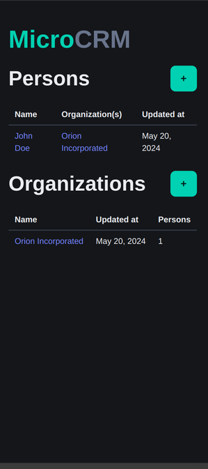
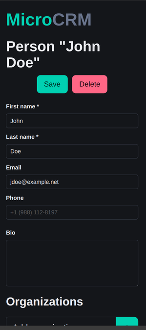

<p align="center">
   
</p>

# MicroCRM (P5 - Expert DevOps - Gérez le cycle de vie de développement logiciel)

MicroCRM est une application de démonstration basique ayant pour être objectif de servir de socle pour le module "P5 - Expert DevOps".

L'application MicroCRM est une implémentation simplifiée d'un ["CRM" (Customer Relationship Management)](https://fr.wikipedia.org/wiki/Gestion_de_la_relation_client). Les fonctionnalités sont limitées à la création, édition et la visualisations des individus liés à des organisations.




## Code source

### Organisation

Ce [monorepo](https://en.wikipedia.org/wiki/Monorepo) contient les 2 composantes du projet "MicroCRM":

- La partie serveur (ou "backend"), en Java SpringBoot 3;
- La partie cliente (ou "frontend"), en Angular 17.

Une intégration basique avec Gitlab CI est définie via le fichier [`.gitlab-ci.yml`](./.gitlab-ci.yml).

### Démarrer avec les sources

#### Serveur

##### Dépendances

- [OpenJDK >= 17](https://openjdk.org/)

##### Procédure

1. Se positionner dans le répertoire `back` avec une invite de commande:

   ```shell
   cd back
   ```

2. Construire le JAR:

   ```shell
   # Sur Linux
   ./gradlew build

   # Sur Windows
   gradlew.bat build
   ```

3. Démarrer le service:

   ```shell
   java -jar build/libs/microcrm-0.0.1-SNAPSHOT.jar
   ```

Puis ouvrir l'URL http://localhost:8080 dans votre navigateur.

#### Client

##### Dépendances

- [NPM >= 10.2.4](https://www.npmjs.com/)

##### Procédure

1. Se positionner dans le répertoire `front` avec une invite de commande:

   ```shell
   cd front
   ```

2. (La première fois seulement) Installer les dépendances NodeJS:

   ```shell
   npm install
   ```

3. Démarrer le service de développement:

   ```shell
   npx @angular/cli serve
   ```

Puis ouvrir l'URL http://localhost:4200 dans votre navigateur.

### Exécution des tests

#### Client

**Dépendances**

- Google Chrome ou Chromium

Dans votre terminal:

```shell
cd front
CHROME_BIN=</path/to/google/chrome> npm test
```

#### Serveur

Dans votre terminal:

```shell
cd back
./gradlew test
```
